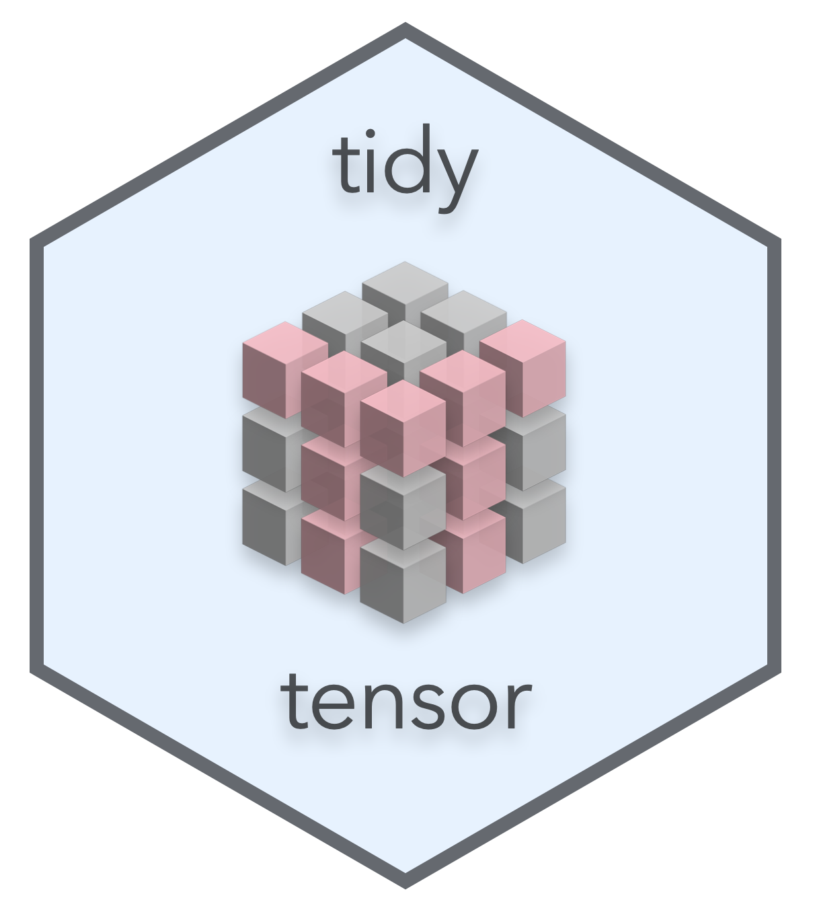
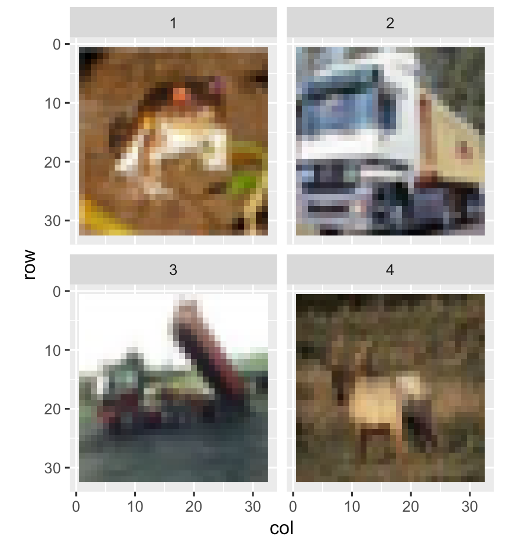

[](https://doi.org/10.5281/zenodo.4968727)
[](https://joss.theoj.org/papers/07ef2e53d083c0eea30c0d08eef0f1cb)
[](https://github.com/oneilsh/tidytensor/actions)
[](https://codecov.io/gh/oneilsh/tidytensor) 


<br />
 

*If you are reading this on [GitHub](https://github.com/oneilsh/tidytensor) be sure to check out the full [documentation](https://oneilsh.github.io/tidytensor/) on GitHub pages.*

TidyTensor is an R package for inspecting and manipulating tensors (multidimensional arrays). It provides an improved `print()` for summarizing structure, named tensors, conversion to data frames, and high-level manipulation functions. Designed to complement the  `keras` package for deep learning in R, functionality is layered on top of base R types.

TidyTensor was inspired by a workshop I taught in deep learning with R, and a desire to explain and explore tensors in a more intuitive way.  


<br />
<br />

## Installation

A simple `devtools::install_github("oneilsh/tidytensor")` will do it. If you don't have `devtools`, first grab it with `install.packages("devtools")`.

If you use TidyTensor, let us know in an [issue](https://github.com/oneilsh/tidytensor/issues/new)!

<br />
<br />

## Examples and Usage

Here we provide just two basic examples of how TidyTensor can help illuminate data used for deep learning. See the [Getting Started](https://oneilsh.github.io/tidytensor/articles/tidytensor.html) vignette for more examples of visualizing tensor structure, filtering and data augmentation, producing train/test splits, and other handy features.


Consider the `CIFAR10` dataset distributed with the `keras` library:

```
## library(keras)
cifar10_raw <- dataset_cifar10()$train$x 
```

TidyTensor can be used to plot the contained image data with the help of other `tidyverse` packages:

```
## library(tidytensor)
## library(ggplot2)
## library(tidyr)

cifar10_raw %>%
  as.tidytensor() %>%
  set_ranknames(image, row, col, channel) %>%
  set_dimnames_for_rank(channel, R, G, B) %>%
  subset(image = 1:4) %>%
  as.data.frame() %>%
  spread(channel, value) %>%
  ggplot() +
    geom_tile(aes(x = col, y = row, fill = rgb(R, G, B, maxColorValue = 255))) +
    facet_wrap( ~ image) +
    coord_equal() +
    scale_y_reverse() +
    scale_fill_identity()
```



For a second example, we can start with a `keras` model and generate a function mapping inputs to internal feature map representations:

```
vgg_model <- application_vgg16(include_top = FALSE, input_shape = c(32, 32, 3))

input <- vgg_model$input
output <- get_layer(vgg_model, name = "block1_conv2")$output

# input shape (N, 32, 32, 3)
# output shape (N, 32, 32, 64) tensor, where last rank are feature maps
compute_featuremaps <- k_function(input, output)
```

TidyTensor can then be used to feed a given set of input tensors through the function and visualize the resulting convolutional feature maps:

```
(cifar10_raw / 255) %>%
  as.tidytensor() %>%
  set_ranknames(image, row, col, channel) %>%
  set_dimnames_for_rank(channel, R, G, B) %>%
  subset(image = 1:4) %>%
  compute_featuremaps() %>% 
  as.tidytensor() %>%
  set_ranknames(image, row, col, featuremap) %>%
  subset(featuremap = 1:6) %>%
  as.data.frame() %>%
  ggplot() +
    geom_tile(aes(x = col, y = row, fill = value)) +
    facet_grid(image ~ featuremap) +
    coord_equal() +
    scale_y_reverse() 
```


<br />
<br />


## Contributing

Pull requests welcome! Please see the [`CONTRIBUTING.md`](https://github.com/oneilsh/tidytensor/blob/master/CONTRIBUTING.md) file for details. 
We are especially interested in additional methods for visualizing or summarizing the structure and content of TidyTensors. 

<br />
<br />

## Changelog

* v1.0.0: Minor documentation improvements, version 1.0 minted for JOSS publication
* v0.9.1: preparation for JOSS submission, many documentation improvements, removing `allow_huge` option from `as.data.frame.tidytensor()`
* v0.9.0: refactor `bottom` paramter of `print()` to `base_rank`
* v0.8.2: minor bugfixes, new combine_ranks() function
* v0.8.1: add [] and [] <- functionality
* v0.8: first version on github


