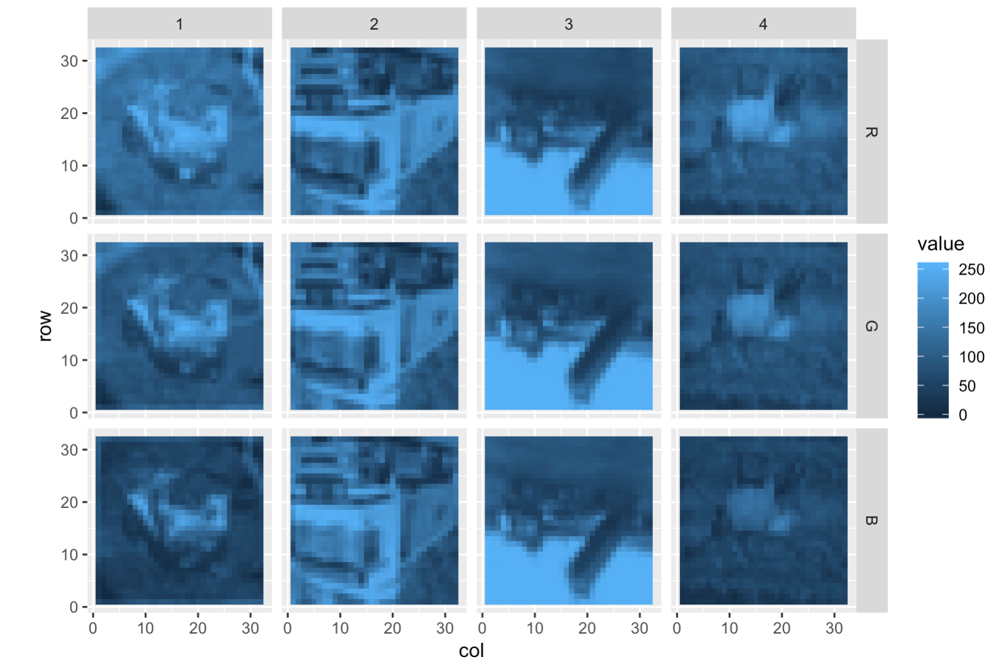
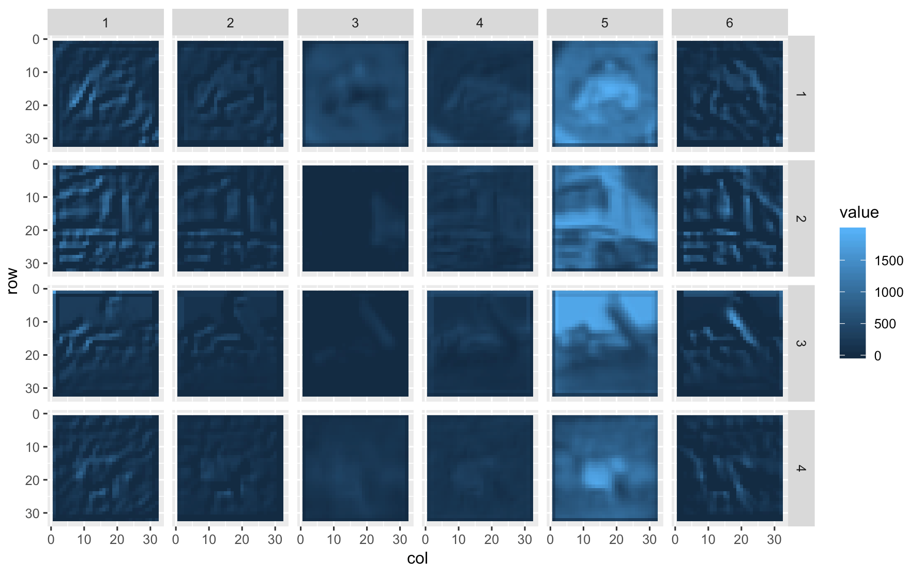
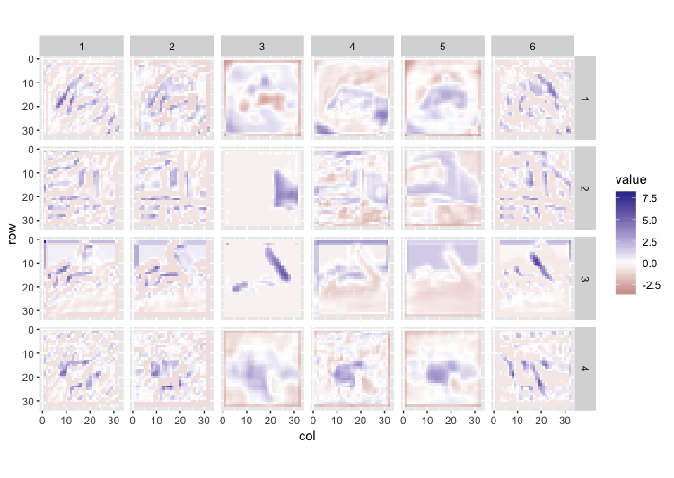

# TidyTensor - More Fun with Deep Learning

TidyTensor is an R package for inspecting and manipulating tensors (multidimensional arrays). It provides an improved `print()` function for summarizing structure, named tensors, conversion to data frames, and high-level manipulation functions. Designed to complement the excellent `keras` package, functionality is layered on top of base R types.

TidyTensor was inspired by a workshop I taught in deep learning with R, and a desire to explain and explore tensors in a more intuitive way.  

   * [Installation](#installation)
   * [Background](#background)
   * [Printing](#printing)
   * [Named Ranks](#named-ranks)
   * [Converting to data.frame and plotting](#converting-to-dataframe-and-plotting)
   * [Manipulation](#manipulation)
     * [`c()` and `bind()`](#c-and-bind)
     * [`partition()` and `as.list()`](#partition-and-aslist)
     * [`shuffle()` and `tt_apply()`](#shuffle-and-tt_apply)
   * [Future Work](#future-work) 

<br />
<br />

### Installation

A simple `devtools::install_github("oneilsh/tidytensor")` will do it. If you don't have `devtools`, grab it with `install.packages("devtools")`. 

### Changelog

0.8.2: minor bugfixes, new combine_ranks() function
0.8.1: add [] and [] <- functionality
0.8: first version on github

### Background

R natively supports *tensors* as one of vectors (1d arrays, or rank-1 tensors), matrices (2d arrays, or rank-2 tensors), or higher-dimensional arrays. Further, these support `names()`, allowing for indexing of elements by index and/or name. 

```r
t1 <- c(1.4, 2.5, 0.5, 1.3)
t1[3]
# [1] 0.5

names(t1) <- c("a", "b", "c", "d")
t1["c"]
#   c 
# 0.5 
```

Matrices:

```r
t2 <- matrix(1:6, nrow = 2, ncol = 3)
t2
```

```
#      [,1] [,2] [,3]
# [1,]    1    3    5
# [2,]    2    4    6
```

```r
t2[1, 2]
```

```
# [1] 3
```

```r
dimnames(t2) <- list(c("row1", "row2"), c("col1", "col2", "col3"))
t2
```
```
#      col1 col2 col3
# row1    1    3    5
# row2    2    4    6
```
```r
t2["row1", "col2"]
```
```
# [1] 3
```

Higher-rank arrays can be created with e.g. `array(1:(3*6*6), dim = c(3, 6, 6))` to create a 3x6x6 structure--these also accept optional `dimnames()`. The *shape* of a tensor is the vector returned by `dim()`, here `c(3, 6, 6)`. To stay with convention we use 'rank' of a tensor rather than 'dimension' of a tensor to avoid confusion in situations like 3d-points being stored in a rank-1 tensor of shape (3). 

TidyTensor levereges the fact that tensors usually represent hierarchical "set of" relationships. For example, a 28x28 grayscale image may be encoded as a rank-2, shape (28, 28) tensor; an RBG color image of the same size would be represented with a rank-3 (3, 28, 28) tensor in a "channels first" representation. On the other hand, we might start with a pixel, represented as a rank-1 shape (3) tensor, and a color image as a 28x28 grid of them with shape (28, 28, 3) in a channels-last representation. (In a [row, col] assumption, this makes each *column* a set of pixels, and each *row* a set of columns.) A set of 1800 color images (1 minute video at 30fps) would be a rank-4 tensor with shape (1800, 3, 28, 28); a set of 100 videos would have shape (100, 1800, 3, 28, 28). 

If this were stored in the R array `data`, then `data[20, 57, , , ]` would select the color image from the 57th frame of the 20th video. By default it would return the shape (3, 28, 28) array from that location, dropping the ranks with only one entry. (This doc similarly refers to individual 'ranks' of a tensor, rather than the sometimes used 'axes', mirroring the rank/dimension distinction.) This can be avoided with an additional `drop = F` parameter: `data[20, 57, , , , drop = F]` returns the rank-5 tensor with shape (1, 1, 3, 28, 28).

### Printing

The default print function for arrays in R is... not great. Whereas groups are typically organized in tensors "leftward," R breaks them down "rightward" and provides little hierarchical organization. (I think Python's `numpy` arrays are better in this regard, but still leave a lot to be desired.) Consider a simulated dataset of 4 color 10x10 images (channels-first):

```r
simulated <- array(runif(4*3*10*10, min = 0, max = 1), dim = c(4, 3, 10, 10))
```

``` 
, , 1, 1

           [,1]      [,2]      [,3]
[1,] 0.04040316 0.0736798 0.5612521
[2,] 0.13227164 0.2328002 0.6063468
[3,] 0.26599225 0.7696131 0.4620570
[4,] 0.71158177 0.5504166 0.0786895

, , 2, 1

          [,1]      [,2]      [,3]
[1,] 0.5346928 0.9155100 0.6935304
[2,] 0.6718270 0.2523032 0.3734726
[3,] 0.8564285 0.0440457 0.9548660
[4,] 0.8864082 0.2974628 0.5131614

, , 3, 1

          [,1]      [,2]      [,3]
[1,] 0.3815334 0.6023006 0.7830635
[2,] 0.7125469 0.4438918 0.3053601
(output truncated)
```

TidyTensor provides a customized `print()` by allowing R vectors, matrices, and arrays to be converted with `as.tidytensor()`, or
the shorthand `tt()`. 

```r
library(tidytensor)
simulated %>% 
  tt()
```
```
# Rank 4 tensor, shape: (4, 3, 10, 10)
|  # Rank 3 tensor, shape: (3, 10, 10)
|  |  # Rank 2 tensor, shape: (10, 10)
|  |      0.131  0.0499  0.674   0.104  0.525  0.0333  ... 
|  |      0.121   0.456  0.404   0.141   0.58   0.235  ... 
|  |      0.516  0.0342  0.407   0.187   0.64   0.805  ... 
|  |      0.172   0.445  0.446   0.565  0.187   0.622  ... 
|  |      0.173   0.442  0.857  0.0947  0.012   0.757  ... 
|  |      0.149    0.76  0.823   0.249  0.361   0.866  ... 
|  |        ...     ...    ...     ...    ...     ...  ... 
|  |  # ...
|  # ...
```

Here the printout is emphasizing the nested nature of tensors and providing a quick structure summary. 

`as.tidytensor()` simply adds an addtional `tidytensor` class entry, so the array can still be used in all the normal ways. The `print()`
function can be customized to show more or fewers rows and columns in the "bottom" tensors and to show dimension names there (it's on the TODO list to also show dimesion names for higher ranks when printing). 

```r
dimnames(simulated)[[3]] <- letters[1:10]
simulated %>%
  tt() %>%
  print(show_names = T, max_rows = 10, max_cols = 10)
```
```
# Rank 4 tensor, shape: (4, 3, 10, 10)
|  # Rank 3 tensor, shape: (3, 10, 10)
|  |  # Rank 2 tensor, shape: (10, 10)
|  |               [,1]    [,2]     [,3]    [,4]   [,5]     [,6]    [,7]    [,8]    [,9]    [,10] 
|  |      ["a",]  0.364   0.324    0.634  0.0693  0.105    0.198   0.502   0.614   0.699    0.102 
|  |      ["b",]  0.523   0.699    0.483   0.455  0.256    0.296   0.834   0.629  0.0319    0.363 
|  |      ["c",]   0.64    0.51    0.947   0.451  0.454    0.685  0.0643   0.759   0.713    0.474 
|  |      ["d",]  0.381  0.0602    0.665   0.108  0.481  0.00834   0.189   0.637   0.943  0.00697 
|  |      ["e",]  0.598   0.635    0.911  0.0918  0.774     0.95  0.0749  0.0682   0.947    0.488 
|  |      ["f",]  0.831   0.114    0.939    0.89  0.748    0.424    0.98   0.711  0.0683     0.19 
|  |      ["g",]  0.411   0.356    0.786   0.617  0.293    0.852  0.0518    0.16    0.57    0.626 
|  |      ["h",]  0.643    0.98    0.759   0.755  0.372    0.249   0.765   0.411   0.665    0.111 
|  |      ["i",]  0.509   0.905    0.631   0.318  0.651    0.937   0.349   0.402   0.693    0.939 
|  |      ["j",]  0.524   0.801  0.00265    0.51  0.573     0.38   0.199   0.722   0.679    0.417 
|  |  # ...
|  # ...
```

And we can see more of the structure by increasing the `max_per_level` parameter:

```r
images %>%
  tt() %>%
  print(max_per_level = 2)
```
```
# Rank 4 tensor, shape: (4, 3, 10, 10)
|  # Rank 3 tensor, shape: (3, 10, 10)
|  |  # Rank 2 tensor, shape: (10, 10)
|  |      0.364   0.324  0.634  0.0693  0.105    0.198  ... 
|  |      0.523   0.699  0.483   0.455  0.256    0.296  ... 
|  |       0.64    0.51  0.947   0.451  0.454    0.685  ... 
|  |      0.381  0.0602  0.665   0.108  0.481  0.00834  ... 
|  |      0.598   0.635  0.911  0.0918  0.774     0.95  ... 
|  |      0.831   0.114  0.939    0.89  0.748    0.424  ... 
|  |        ...     ...    ...     ...    ...      ...  ... 
|  |  # Rank 2 tensor, shape: (10, 10)
|  |       0.984  0.955  0.0646    0.92   0.47  0.365  ... 
|  |      0.0408  0.507   0.436  0.0577   0.34  0.899  ... 
|  |        0.72  0.169   0.582   0.416  0.796  0.763  ... 
|  |       0.809  0.669   0.878   0.905   0.04  0.812  ... 
|  |        0.91  0.498  0.0835   0.792  0.602  0.367  ... 
|  |       0.695  0.394   0.895     0.7  0.942  0.983  ... 
|  |         ...    ...     ...     ...    ...    ...  ... 
|  |  # ...
|  # Rank 3 tensor, shape: (3, 10, 10)
|  |  # Rank 2 tensor, shape: (10, 10)
|  |      0.919   0.502   0.825   0.761   0.408  0.323  ... 
|  |      0.909   0.731   0.629   0.101   0.987  0.119  ... 
|  |      0.388   0.126    0.87   0.504   0.215  0.621  ... 
|  |      0.186  0.0857  0.0534   0.338   0.164   0.31  ... 
|  |      0.431    0.26   0.302   0.953  0.0398   0.52  ... 
|  |      0.853   0.157   0.812  0.0338   0.782   0.27  ... 
|  |        ...     ...     ...     ...     ...    ...  ... 
|  |  # Rank 2 tensor, shape: (10, 10)
|  |       0.341    0.189   0.871   0.761  0.0608  0.951  ... 
|  |       0.593   0.0416   0.582    0.77   0.068  0.693  ... 
|  |       0.605    0.581   0.953   0.868   0.634   0.26  ... 
|  |      0.0969  0.00446   0.953  0.0621   0.336  0.151  ... 
|  |       0.148    0.646  0.0294   0.436   0.646  0.111  ... 
|  |       0.511    0.873   0.472   0.435  0.0883  0.113  ... 
|  |         ...      ...     ...     ...     ...    ...  ... 
|  |  # ...
|  # ...
```

What if our data were in channels-last configuration? In cases where we want to visualize the last rank as a vector within a matrix like this
(pixels in an image, or channels in a filter map) we can specify `bottom = "3d"`.

```r
array(runif(4*10*10*3, min = 0, max = 1), dim = c(4, 10, 10, 3)) %>%
  tt() %>%
  print(bottom = "3d")
```
```
# Rank 4 tensor, shape: (4, 10, 10, 3)
|  # Rank 3 tensor, shape: (10, 10, 3)
|        [0.45, 0.177, 0.791]   [0.687, 0.617, 0.677]  [0.144, 0.352, 0.687]    [0.999, 0.44, 0.963]   [0.0476, 0.581, 0.309]  [0.735, 0.729, 0.308]  ... 
|        [0.707, 0.36, 0.877]   [0.765, 0.966, 0.069]  [0.427, 0.053, 0.248]   [0.243, 0.617, 0.452]   [0.899, 0.243, 0.0638]   [0.83, 0.523, 0.665]  ... 
|        [0.23, 0.853, 0.844]   [0.165, 0.436, 0.984]  [0.833, 0.404, 0.211]  [0.692, 0.0292, 0.349]   [0.425, 0.0624, 0.736]  [0.176, 0.351, 0.667]  ... 
|       [0.233, 0.815, 0.237]   [0.697, 0.205, 0.462]  [0.918, 0.652, 0.592]    [0.217, 0.43, 0.971]     [0.815, 0.603, 0.86]  [0.803, 0.778, 0.186]  ... 
|       [0.487, 0.631, 0.569]  [0.545, 0.382, 0.0933]   [0.662, 0.56, 0.439]  [0.0766, 0.634, 0.534]    [0.867, 0.153, 0.158]   [0.608, 0.881, 0.19]  ... 
|      [0.108, 0.0783, 0.125]   [0.267, 0.937, 0.339]  [0.445, 0.416, 0.928]   [0.822, 0.949, 0.258]  [0.456, 0.943, 0.00864]  [0.678, 0.627, 0.232]  ... 
|                         ...                     ...                    ...                     ...                      ...                    ...  ... 
|  # ...
```

Here each channel is represented as a vector within the grid. There's also a `bottom = "1d"` for situations where a grid display doesn't make sense.

```r
array(rnorm(4*10*8), dim = c(4, 10, 8)) %>%
  tt() %>%
  print(bottom = "1d", max_per_level = 2)
```
```
# Rank 3 tensor, shape: (4, 10, 8)
|  # Rank 2 tensor, shape: (10, 8)
|  |  # Rank 1 tensor, shape: (8)
|  |      0.291  0.751  -0.0842  0.991  -0.626  -0.6  ... 
|  |  # Rank 1 tensor, shape: (8)
|  |      0.814  -0.478  1.15  -0.244  -1.62  -1.28  ... 
|  |  # ...
|  # Rank 2 tensor, shape: (10, 8)
|  |  # Rank 1 tensor, shape: (8)
|  |      -0.987  -0.451  2.17  0.838  0.646  -0.868  ... 
|  |  # Rank 1 tensor, shape: (8)
|  |      0.429  0.481  -0.339  -1.78  0.332  1.42  ... 
|  |  # ...
|  # ...
```

The default for `bottom` is `"auto"`, which selects `"2d"` when the input looks like a set of channels-first images (3rd-to-last rank is of size 3, or last two ranks are equal in size), `"3d"` if it looks like a channels-last image (last rank is of size 3 or 1), and otherwise falls back to `"1d"`. 

### Named Ranks

Tidytensors support `ranknames()` in addition to `dimnames()` (implemented as `names(dimnames())`) for meaningful annotation. Here's a basic print for the CIFAR10 dataset provided by `keras`:

```r
library(keras)

images <- dataset_cifar10()$train$x
images %>% tt()
```

```
# Rank 4 tensor, shape: (50000, 32, 32, 3)
|  # Rank 3 tensor, shape: (32, 32, 3)
|      [59, 62, 63]  [43, 46, 45]   [50, 48, 43]   [68, 54, 42]   [98, 73, 52]  [119, 91, 63]  ... 
|      [16, 20, 20]     [0, 0, 0]     [18, 8, 0]    [51, 27, 8]   [88, 51, 21]  [120, 82, 43]  ... 
|      [25, 24, 21]    [16, 7, 0]    [49, 27, 8]   [83, 50, 23]  [110, 72, 41]  [129, 92, 54]  ... 
|      [33, 25, 17]   [38, 20, 4]   [87, 54, 25]  [106, 63, 28]  [115, 70, 33]  [117, 74, 35]  ... 
|      [50, 32, 21]  [59, 32, 11]  [102, 65, 34]  [127, 79, 39]  [124, 77, 36]  [121, 77, 36]  ... 
|      [71, 48, 29]  [84, 53, 24]  [110, 73, 37]  [129, 82, 38]  [136, 88, 45]  [131, 84, 42]  ... 
|               ...           ...            ...            ...            ...            ...  ... 
|  # ...

```

A set of 50000 32x32 RGB images, in a channels-last organization. We can set ranknames with either `ranknames(t) <-` syntax or the `%>%`-friendly and bare-name ready `set_ranknames()`.

```r
images <- dataset_cifar10()$train$x

images <- tt(images)
ranknames(images) <- c("image", "row", "col", "channel")
images

# OR
images %>%
  tt() %>%
  set_ranknames(image, row, col, channel)

# OR
images %>%
  tt() %>%
  set_ranknames(.dots = c("image", "row", "col", "channel"))
```

```
# Rank 4 tensor, shape: (50000, 32, 32, 3), ranknames: image, row, col, channel
|  # Rank 3 tensor, shape: (32, 32, 3)
|      [59, 62, 63]  [43, 46, 45]   [50, 48, 43]   [68, 54, 42]   [98, 73, 52]  [119, 91, 63]  ... 
|      [16, 20, 20]     [0, 0, 0]     [18, 8, 0]    [51, 27, 8]   [88, 51, 21]  [120, 82, 43]  ... 
|      [25, 24, 21]    [16, 7, 0]    [49, 27, 8]   [83, 50, 23]  [110, 72, 41]  [129, 92, 54]  ... 
|      [33, 25, 17]   [38, 20, 4]   [87, 54, 25]  [106, 63, 28]  [115, 70, 33]  [117, 74, 35]  ... 
|      [50, 32, 21]  [59, 32, 11]  [102, 65, 34]  [127, 79, 39]  [124, 77, 36]  [121, 77, 36]  ... 
|      [71, 48, 29]  [84, 53, 24]  [110, 73, 37]  [129, 82, 38]  [136, 88, 45]  [131, 84, 42]  ... 
|               ...           ...            ...            ...            ...            ...  ... 
|  # ...
```

(Another TODO: show ranknames for bottom ranks at those levels as well.) 

Named ranks make a variety of operations easier, or at least more explicit. For example, we may wish to permute the ranks to a channels-first representation, then 
set dimensions names for the `channel` rank.

```r
images %>%
  tt() %>%
  set_ranknames(image, row, col, channel) %>%
  permute(image, channel, row, col) %>%
  set_dimnames_for_rank(channel, R, G, B) %>%
  print(max_per_level = 2)
```

```
# Rank 4 tensor, shape: (50000, 3, 32, 32), ranknames: image, channel, row, col
|  # Rank 3 tensor, shape: (3, 32, 32)
|  |  # Rank 2 tensor, shape: (32, 32)
|  |       59   43   50   68   98  119  ... 
|  |       16    0   18   51   88  120  ... 
|  |       25   16   49   83  110  129  ... 
|  |       33   38   87  106  115  117  ... 
|  |       50   59  102  127  124  121  ... 
|  |       71   84  110  129  136  131  ... 
|  |      ...  ...  ...  ...  ...  ...  ... 
|  |  # Rank 2 tensor, shape: (32, 32)
|  |       62   46   48   54   73   91  ... 
|  |       20    0    8   27   51   82  ... 
|  |       24    7   27   50   72   92  ... 
|  |       25   20   54   63   70   74  ... 
|  |       32   32   65   79   77   77  ... 
|  |       48   53   73   82   88   84  ... 
|  |      ...  ...  ...  ...  ...  ...  ... 
|  |  # ...
|  # Rank 3 tensor, shape: (3, 32, 32)
|  |  # Rank 2 tensor, shape: (32, 32)
|  |      154  126  105  102  125  155  ... 
|  |      140  145  125  124  150  152  ... 
|  |      140  139  115  147  138  132  ... 
|  |      136  137  122  132  151  181  ... 
|  |      129  141  136  186  215  202  ... 
|  |      136  136  127  153  138  120  ... 
|  |      ...  ...  ...  ...  ...  ...  ... 
|  |  # Rank 2 tensor, shape: (32, 32)
|  |      177  137  104  101  131  166  ... 
|  |      160  153  125  129  161  164  ... 
|  |      155  146  115  153  150  145  ... 
|  |      147  142  121  133  157  193  ... 
|  |      137  146  139  186  220  216  ... 
|  |      144  149  148  172  160  141  ... 
|  |      ...  ...  ...  ...  ...  ...  ... 
|  |  # ...
|  # ...
```

### Converting to `data.frame` and plotting

Named ranks also work well with conversion to data frame. We'll convert just a few images, because tensors in data frame representation are significantly larger (approximately number-of-ranks times as large). `as.data.frame()` will by default throw an error when more than a 10-million-entry
data frame would result, unless `allow_huge = TRUE` is set.

```r
images[1:4, , , ] %>%
  tt() %>%
  set_ranknames(image, row, col, channel) %>%
  permute(image, channel, row, col) %>%
  set_dimnames_for_rank(channel, R, G, B) %>%
  as.data.frame() %>%
  head()
```
```
  image channel row col value
1     1       R   1   1    59
2     2       R   1   1   154
3     3       R   1   1   255
4     4       R   1   1    28
5     1       G   1   1    62
6     2       G   1   1   177
```

The third row here indicates that the value in `images[3, "R", 1, 1]` is 255. Non-named tensors get generic 
column names. In the case of set `dimnames()` as in `R`, `G`, and `B` above, factors are created
with the level ordering determined by the `dimnames()` ordering. 

This provides a nice interface for visualization with `ggplot2`.

```r
images[1:4, , , ] %>%
  tt() %>%
  set_ranknames(image, row, col, channel) %>%
  permute(image, channel, row, col) %>%
  set_dimnames_for_rank(channel, R, G, B) %>%
  as.data.frame() %>%
  ggplot() +
    geom_tile(aes(x = col, y = row, fill = value)) +
    facet_grid(channel ~ image) +
    coord_equal()
```



It's a little hard to make out, but these images are upside-down, because image data are typically encoded with an inverted y-axis, so next time we'll add a `scale_y_reverse()` as well. To get fancy, we can use `tidyr::spread()` to create individual `R`, `G`, and
`B` columns, combined with `rgb()` and `scale_fill_identity()` to merge the channels into color images.

```r
library(tidyr)

images[1:4, , , ] %>%
  tt() %>%
  set_ranknames(image, row, col, channel) %>%
  permute(image, channel, row, col) %>%
  set_dimnames_for_rank(channel, R, G, B) %>%
  as.data.frame() %>%
  spread(channel, value) %>%
  ggplot() +
    geom_tile(aes(x = col, y = row, fill = rgb(R, G, B, maxColorValue = 255))) +
    facet_wrap( ~ image) +
    coord_equal() +
    scale_y_reverse() +
    scale_fill_identity()
```


These techniques work nicely for model investigation, for example in plotting internal feature maps produced by deep models. We'll start by importing a predefined model and creating a function that maps input tensors to feature maps using the `keras` API.

```r
vgg_model <- application_vgg16(include_top = FALSE, input_shape = c(32, 32, 3))

input <- vgg_model$input
output <- get_layer(vgg_model, name = "block1_conv2")$output

# input shape (N, 32, 32, 3)
# output shape (N, 32, 32, 64) tensor, where last rank are feature maps
compute_featuremaps <- k_function(input, output)
```

To visualize the feature maps we generate an output tensor, name it, convert it to data frame, select only the first six featuremaps with `dplyr::filter()` to keep it reasonable, and then plot the values.

```r
library(dplyr)

compute_featuremaps(images[1:4, , ,]) %>% 
  tt() %>%
  set_ranknames(image, row, col, featuremap) %>%
  as.data.frame(allow_huge = T) %>%
  filter(featuremap <= 6) %>%
  ggplot() +
    geom_tile(aes(x = col, y = row, fill = value)) +
    facet_grid(image ~ featuremap) +
    coord_equal() +
    scale_y_reverse() 
```




### Manipulation

#### `c()` and `bind()`

A few functions are included for transforming or working with tensors. We've already seen `permute()` which re-orders ranks (and is a rankname-aware wrapper around `base::aperm()`). There are also `c()` and `bind()`. To start with we'll extract three subsets of CIFAR10 images of different sizes; `subset()` provides a  `%>%`-friendly alternative to `[]`.

```r
images <- dataset_cifar10()$train$x
images <- tt(images) %>% 
  set_ranknames(image, row, col, channel) %>%
  set_dimnames_for_rank(channel, R, G, B)

seta <- images[1:4, , ,]
setb <- images[5:7, , ,]
setc <- images[8:16, , ,]

seta <- images %>% subset(image = 1:4)
setb <- images %>% subset(image = 5:8)
setc <- images %>% subset(image = 9:16)
```

While on the subset of `subset()`, the syntax allows using ranknames as above, or in the case of not specifying
by name uses the first ranks; e.g. `subset(images, 1:4, 1:10, 1:12)` selects the first 4 images, the first 10 rows, the first 12 columns, and all of other unspecified ranks, as does `subset(images, image = 1:4, row = 1:10, col = 1:12)`. If the dimensions are named, those can be used as well, and the function also takes a `drop` argument defaulting to `TRUE` to drop ranks with only one entry (to match `[]` functionality), as in
`subset(images, image = 1, channel = c("G", "B"), drop = FALSE)` selects all rows, all columns, and just the green and blue channels from the first image, without dropping the image rank.

The `c()` function concatenates multiple tensors of the same shape except for the first rank, into a single tensor representing a concatenated set. (`c()` can also take a list of tensors.)

```r
result <- c(seta, setb, setc)
print(result)
```

```
# Rank 4 tensor, shape: (16, 32, 32, 3), ranknames: image, row, col, channel
|  # Rank 3 tensor, shape: (32, 32, 3)
|      [59, 62, 63]  [43, 46, 45]   [50, 48, 43]   [68, 54, 42]   [98, 73, 52]  [119, 91, 63]  ... 
|      [16, 20, 20]     [0, 0, 0]     [18, 8, 0]    [51, 27, 8]   [88, 51, 21]  [120, 82, 43]  ... 
|      [25, 24, 21]    [16, 7, 0]    [49, 27, 8]   [83, 50, 23]  [110, 72, 41]  [129, 92, 54]  ... 
|      [33, 25, 17]   [38, 20, 4]   [87, 54, 25]  [106, 63, 28]  [115, 70, 33]  [117, 74, 35]  ... 
|      [50, 32, 21]  [59, 32, 11]  [102, 65, 34]  [127, 79, 39]  [124, 77, 36]  [121, 77, 36]  ... 
|      [71, 48, 29]  [84, 53, 24]  [110, 73, 37]  [129, 82, 38]  [136, 88, 45]  [131, 84, 42]  ... 
|               ...           ...            ...            ...            ...            ...  ... 
|  # ...
```

`bind()`, on the other hand, collects multiple tensors of the *exact* same shape into a new tensor with
one higher rank. 

```r
result <- bind(seta, setb, new_rank_name = "sets")
print(result)
```

```
# Rank 5 tensor, shape: (2, 4, 32, 32, 3), ranknames: sets, image, row, col, channel
|  # Rank 4 tensor, shape: (4, 32, 32, 3)
|  |  # Rank 3 tensor, shape: (32, 32, 3)
|  |      [59, 62, 63]  [43, 46, 45]   [50, 48, 43]   [68, 54, 42]   [98, 73, 52]  [119, 91, 63]  ... 
|  |      [16, 20, 20]     [0, 0, 0]     [18, 8, 0]    [51, 27, 8]   [88, 51, 21]  [120, 82, 43]  ... 
|  |      [25, 24, 21]    [16, 7, 0]    [49, 27, 8]   [83, 50, 23]  [110, 72, 41]  [129, 92, 54]  ... 
|  |      [33, 25, 17]   [38, 20, 4]   [87, 54, 25]  [106, 63, 28]  [115, 70, 33]  [117, 74, 35]  ... 
|  |      [50, 32, 21]  [59, 32, 11]  [102, 65, 34]  [127, 79, 39]  [124, 77, 36]  [121, 77, 36]  ... 
|  |      [71, 48, 29]  [84, 53, 24]  [110, 73, 37]  [129, 82, 38]  [136, 88, 45]  [131, 84, 42]  ... 
|  |               ...           ...            ...            ...            ...            ...  ... 
|  |  # ...
|  # ...
```

#### `partition()` and `as.list()`


The `partition()` function works as an inverse of `c()`, partitioning a tensor into a list of tensors of relative proportions along the first rank, which may be handy for generating train/validate/test splits (particularly when combined with `shuffle()`, below). 

```r
images <- tt(images) %>% 
  set_ranknames(image, row, col, channel) %>%
  set_dimnames_for_rank(channel, R, G, B)

labels <- dataset_cifar10()$train$y %>%
  tt() %>% 
  set_ranknames(image, label)
  
split_images <- images %>% partition(c(0.1, 0.1, 0.8))
split_labels <- labels %>% partition(c(0.1, 0.1, 0.8))

print(split_images)
```

```
[[1]]
# Rank 4 tensor, shape: (5000, 32, 32, 3), ranknames: image, row, col, channel
|  # Rank 3 tensor, shape: (32, 32, 3)
|      [59, 62, 63]  [43, 46, 45]   [50, 48, 43]   [68, 54, 42]   [98, 73, 52]  [119, 91, 63]  ... 
|      [16, 20, 20]     [0, 0, 0]     [18, 8, 0]    [51, 27, 8]   [88, 51, 21]  [120, 82, 43]  ... 
|      [25, 24, 21]    [16, 7, 0]    [49, 27, 8]   [83, 50, 23]  [110, 72, 41]  [129, 92, 54]  ... 
|      [33, 25, 17]   [38, 20, 4]   [87, 54, 25]  [106, 63, 28]  [115, 70, 33]  [117, 74, 35]  ... 
|      [50, 32, 21]  [59, 32, 11]  [102, 65, 34]  [127, 79, 39]  [124, 77, 36]  [121, 77, 36]  ... 
|      [71, 48, 29]  [84, 53, 24]  [110, 73, 37]  [129, 82, 38]  [136, 88, 45]  [131, 84, 42]  ... 
|               ...           ...            ...            ...            ...            ...  ... 
|  # ...

[[2]]
# Rank 4 tensor, shape: (5000, 32, 32, 3), ranknames: image, row, col, channel
|  # Rank 3 tensor, shape: (32, 32, 3)
|         [60, 82, 54]     [40, 68, 36]     [52, 81, 52]     [57, 83, 56]     [45, 72, 43]  [48, 76, 48]  ... 
|      [112, 114, 114]     [58, 71, 56]     [58, 81, 53]     [59, 88, 58]     [47, 80, 52]  [50, 83, 54]  ... 
|      [170, 161, 178]  [119, 118, 120]     [80, 89, 74]     [63, 86, 62]     [53, 85, 58]  [51, 85, 57]  ... 
|      [180, 170, 190]  [182, 171, 186]  [141, 135, 138]     [84, 95, 80]     [53, 80, 55]  [50, 82, 55]  ... 
|      [129, 121, 133]  [167, 154, 170]  [173, 161, 175]  [134, 133, 131]     [78, 88, 72]  [55, 74, 51]  ... 
|         [62, 55, 58]   [104, 94, 104]  [152, 142, 158]  [168, 156, 170]  [145, 133, 137]  [94, 92, 80]  ... 
|                  ...              ...              ...              ...              ...           ...  ... 
|  # ...

[[3]]
# Rank 4 tensor, shape: (40000, 32, 32, 3), ranknames: image, row, col, channel
|  # Rank 3 tensor, shape: (32, 32, 3)
|         [35, 25, 26]  [27, 21, 21]  [25, 20, 19]  [26, 18, 18]  [24, 15, 15]  [22, 13, 14]  ... 
|         [63, 55, 50]  [32, 27, 21]   [17, 13, 8]  [21, 14, 11]  [24, 15, 14]  [23, 15, 13]  ... 
|         [99, 91, 84]  [49, 45, 37]   [15, 12, 5]   [20, 13, 8]  [24, 17, 12]  [24, 17, 12]  ... 
|       [111, 103, 99]  [70, 65, 61]  [38, 34, 30]  [31, 25, 19]  [36, 29, 23]  [35, 28, 22]  ... 
|      [124, 118, 115]  [96, 91, 88]  [71, 66, 63]  [47, 41, 34]  [49, 42, 34]  [42, 35, 28]  ... 
|      [123, 118, 115]  [99, 94, 91]  [82, 77, 74]  [55, 48, 41]  [52, 45, 37]  [52, 45, 37]  ... 
|                  ...           ...           ...           ...           ...           ...  ... 
|  # ...
```

```r
print(split_labels)
```

```
[[1]]
# Rank 2 tensor, shape: (5000, 1), ranknames: image, label
|  # Rank 1 tensor, shape: (1)
|      6 
|  # ...

[[2]]
# Rank 2 tensor, shape: (5000, 1), ranknames: image, label
|  # Rank 1 tensor, shape: (1)
|      6 
|  # ...

[[3]]
# Rank 2 tensor, shape: (40000, 1), ranknames: image, label
|  # Rank 1 tensor, shape: (1)
|      1 
|  # ...
```

The proportions vector needn't add to `1.0` - the sizes are normalized, such that `c(1, 1, 2)` is equal to `c(0.25, 0.25, 0.5)`.

`as.list()` functions as the inverse of `bind()`, partitioning tensors into lists of sub-tensors.

```r
images %>%
  subset(image = 1:3) %>%
  as.list()
```

```
$`image [1, , , ], shape (32, 32, 3)`
# Rank 3 tensor, shape: (32, 32, 3), ranknames: row, col, channel
    [59, 62, 63]  [43, 46, 45]   [50, 48, 43]   [68, 54, 42]   [98, 73, 52]  [119, 91, 63]  ... 
    [16, 20, 20]     [0, 0, 0]     [18, 8, 0]    [51, 27, 8]   [88, 51, 21]  [120, 82, 43]  ... 
    [25, 24, 21]    [16, 7, 0]    [49, 27, 8]   [83, 50, 23]  [110, 72, 41]  [129, 92, 54]  ... 
    [33, 25, 17]   [38, 20, 4]   [87, 54, 25]  [106, 63, 28]  [115, 70, 33]  [117, 74, 35]  ... 
    [50, 32, 21]  [59, 32, 11]  [102, 65, 34]  [127, 79, 39]  [124, 77, 36]  [121, 77, 36]  ... 
    [71, 48, 29]  [84, 53, 24]  [110, 73, 37]  [129, 82, 38]  [136, 88, 45]  [131, 84, 42]  ... 
             ...           ...            ...            ...            ...            ...  ... 

$`image [2, , , ], shape (32, 32, 3)`
# Rank 3 tensor, shape: (32, 32, 3), ranknames: row, col, channel
    [154, 177, 187]  [126, 137, 136]   [105, 104, 95]   [102, 101, 99]  [125, 131, 139]  [155, 166, 180]  ... 
    [140, 160, 169]  [145, 153, 154]  [125, 125, 118]  [124, 129, 132]  [150, 161, 173]  [152, 164, 175]  ... 
    [140, 155, 164]  [139, 146, 149]  [115, 115, 112]  [147, 153, 159]  [138, 150, 162]  [132, 145, 154]  ... 
    [136, 147, 155]  [137, 142, 146]  [122, 121, 121]  [132, 133, 139]  [151, 157, 167]  [181, 193, 198]  ... 
    [129, 137, 144]  [141, 146, 152]  [136, 139, 142]  [186, 186, 190]  [215, 220, 227]  [202, 216, 223]  ... 
    [136, 144, 149]  [136, 149, 165]  [127, 148, 164]  [153, 172, 181]  [138, 160, 173]  [120, 141, 161]  ... 
                ...              ...              ...              ...              ...              ...  ... 

$`image [3, , , ], shape (32, 32, 3)`
# Rank 3 tensor, shape: (32, 32, 3), ranknames: row, col, channel
    [255, 255, 255]  [253, 253, 253]  [253, 253, 253]  [253, 253, 253]  [253, 253, 253]  [253, 253, 253]  ... 
    [255, 255, 255]  [255, 255, 255]  [255, 255, 255]  [255, 255, 255]  [255, 255, 255]  [255, 255, 255]  ... 
    [255, 255, 255]  [254, 254, 254]  [254, 254, 254]  [254, 254, 254]  [254, 254, 254]  [254, 254, 254]  ... 
    [255, 255, 255]  [255, 255, 255]  [255, 255, 255]  [255, 255, 255]  [255, 255, 255]  [255, 255, 255]  ... 
    [255, 255, 255]  [255, 255, 255]  [255, 255, 255]  [255, 255, 255]  [255, 255, 255]  [255, 255, 255]  ... 
    [255, 255, 255]  [255, 255, 255]  [255, 255, 255]  [255, 255, 255]  [255, 255, 255]  [255, 255, 255]  ... 
                ...              ...              ...              ...              ...              ...  ... 
```

Note that the result is a named list with entries describing their contents. It's possible to split at ranks lower than the first; in this case all of the sub-tensors at that level become list elements. (This function can take while if the resulting list is very large, which is quite possible with large tensors.)

```r
images %>% 
  subset(image = 1:3) %>%
  permute(image, channel, row, col) %>%
  as.list(rank = channel)
```

```
$`channel [1, 1, , ], shape (32, 32)`
# Rank 2 tensor, shape: (32, 32), ranknames: row, col
     59   43   50   68   98  119  ... 
     16    0   18   51   88  120  ... 
     25   16   49   83  110  129  ... 
     33   38   87  106  115  117  ... 
     50   59  102  127  124  121  ... 
     71   84  110  129  136  131  ... 
    ...  ...  ...  ...  ...  ...  ... 

$`channel [1, 2, , ], shape (32, 32)`
# Rank 2 tensor, shape: (32, 32), ranknames: row, col
     62   46   48   54   73   91  ... 
     20    0    8   27   51   82  ... 
     24    7   27   50   72   92  ... 
     25   20   54   63   70   74  ... 
     32   32   65   79   77   77  ... 
     48   53   73   82   88   84  ... 
    ...  ...  ...  ...  ...  ...  ... 

$`channel [1, 3, , ], shape (32, 32)`
# Rank 2 tensor, shape: (32, 32), ranknames: row, col
     63   45   43   42   52   63  ... 
     20    0    0    8   21   43  ... 
     21    0    8   23   41   54  ... 
     17    4   25   28   33   35  ... 
     21   11   34   39   36   36  ... 
     29   24   37   38   45   42  ... 
    ...  ...  ...  ...  ...  ...  ... 

$`channel [2, 1, , ], shape (32, 32)`
# Rank 2 tensor, shape: (32, 32), ranknames: row, col
    154  126  105  102  125  155  ... 
    140  145  125  124  150  152  ... 
    140  139  115  147  138  132  ... 
    136  137  122  132  151  181  ... 
    129  141  136  186  215  202  ... 
    136  136  127  153  138  120  ... 
    ...  ...  ...  ...  ...  ...  ... 
(output truncated)
```

If `flatten = FALSE`, a nested list is returned (compatible with the marvelous [`data.tree`](https://cran.r-project.org/web/packages/data.tree/vignettes/data.tree.html) package).

```r
images %>% 
  subset(image = 1:3) %>%
  permute(image, channel, row, col) %>%
  as.list(rank = channel, flatten = FALSE) %>%
  str(give.attr = FALSE)
```

```
List of 3
 $ image [1, , , ], shape (3, 32, 32):List of 3
  ..$ channel [1, 1, , ], shape (32, 32): int [1:32, 1:32] 59 16 25 33 50 71 97 115 137 154 ...
  ..$ channel [1, 2, , ], shape (32, 32): int [1:32, 1:32] 62 20 24 25 32 48 69 82 100 120 ...
  ..$ channel [1, 3, , ], shape (32, 32): int [1:32, 1:32] 63 20 21 17 21 29 40 49 68 89 ...
 $ image [2, , , ], shape (3, 32, 32):List of 3
  ..$ channel [2, 1, , ], shape (32, 32): int [1:32, 1:32] 154 140 140 136 129 136 146 162 127 71 ...
  ..$ channel [2, 2, , ], shape (32, 32): int [1:32, 1:32] 177 160 155 147 137 144 154 172 137 75 ...
  ..$ channel [2, 3, , ], shape (32, 32): int [1:32, 1:32] 187 169 164 155 144 149 172 192 138 69 ...
 $ image [3, , , ], shape (3, 32, 32):List of 3
  ..$ channel [3, 1, , ], shape (32, 32): int [1:32, 1:32] 255 255 255 255 255 255 255 255 255 255 ...
  ..$ channel [3, 2, , ], shape (32, 32): int [1:32, 1:32] 255 255 255 255 255 255 255 255 255 255 ...
  ..$ channel [3, 3, , ], shape (32, 32): int [1:32, 1:32] 255 255 255 255 255 255 255 255 255 255 ...
```

As a reminder with all this list-of-tensors making, `bind()` and `c()` can each take a list of tensors
of the appropriate shape as opposed to one-per-parameter.

#### `shuffle()` and `tt_apply()`


The `shuffle()` function shuffles the elements along the first rank. Only the first rank is supported, as lower ranks would break the 'set-of-sets' intuition that tidytensor relies on; for example, in a channels-last configurition, shuffling the channels would shuffle them identically for all images in the dataset. This function accepts an optional `seed` argument to pass to `set.seed()` for repeatable randomness, again handy for generating training/testing splits. 

```r
# shuffle then partition
train_test_images <- images %>% 
  shuffle(seed = 42) %>%
  partition(c(0.2, 0.8))
  
# shuffle similarly then partition
train_test_labels <- labels %>% 
  shuffle(seed = 42) %>%
  partition(c(0.2, 0.8))
```

#### `tt_apply()`

Finally we have `tt_apply()`, tidytensor's answer to base-R `apply()`, another area of not-greatness for arrays in R. While `apply()` allows applying over arbitrary ranks with the `MARGIN` parameter, it not only removes metadata, it *deconstructs* each call's return value into a vector, before *prepending* it to the remaining ranks. If `t` has shape `(500, 3, 26, 26)` and `normalize` is a function that returns an array of the same shape as it's input, `apply(t, MARGIN = c(1, 2), normalize)` doesn't return a tensor of the same shape as `t`, but rather shape `c(26 * 26, 500, 3)`. Blech. `tt_apply()` uses `apply()` under the hood, but puts all the pieces back together nicely (and is rankname-aware for both function inputs and outputs). 

However, `tt_apply()` is limited compared to `apply()` in one respect, it only applies over the "top" N ranks, to stick with the sets-of-sets metaphor. If `t` has ranknames `c("image", "channel", "row", "col")`, we can `tt_apply()` over every image, or every channel (within each image), or every row (within each channel within each image), and so on. Should a different grouping be desired, `permute()` can help.

Here's a `normalize()` function that respects metadata of input tidytensors (most R functions do, `[]`, `apply()`, and `scale()` are notable exceptions).

```r
# scales to [0, 1]
normalize <- function(t) {
  t <- t - min(t)
  t <- t / max(t)
  return(t)
}
```

For pre-processing, rather than scale the entire dataset to a [0,1] range, perhaps we'd like to do 
so for each channel of each image, maximizing the dynamic range utilized (but perhaps not actually useful
for model training!).

```r
images_normalized <- images %>%
  permute(image, channel, row, col) %>%   # permute to channels-first
  tt_apply(channel, normalize) %>%        # normalize each (row, col) tensor
  permute(image, row, col, channel)       # permute back if we want
```

Notice that here we've organized the data channel-first so we can do our per-image, per-channel normalization, then permuted back to the original. Even though `tt_apply()` is built on base-R `apply()`, applying can take some time, as a function call is being executed for each entry asked for and there can be *quite* a few in a large tensor. 

The function call results needn't match their input shape: `tt_apply()` just needs returned result to be tensors (vectors, matrices, arrays, or tidytensors) all of the same shape. The featuremap example above was difficult to visualize due to the range of map values; we can get an alternative look by scaling to a zero mean, one variance per featuremap. (Or perhaps we should build a model with batch-normalization!)

```r
images <- dataset_cifar10()$train$x %>%
  tt() %>% 
  set_ranknames(image, row, col, channel) %>%
  set_dimnames_for_rank(channel, R, G, B)
  
library(dplyr)   # for filter()
library(ggplot2)
  
images %>% 
  subset(image = 1:4) %>%
  compute_featuremaps() %>%
  tt() %>%
  set_ranknames(image, row, col, featuremap) %>%
  permute(image, featuremap, row, col) %>%
  tt_apply(featuremap, function(t) {
    (t - mean(t)) / sd(t)
  }) %>%
  as.data.frame() %>%
  filter(featuremap <= 6) %>%
  ggplot() +
    geom_tile(aes(x = col, y = row, fill = value)) +
    facet_grid(image ~ featuremap) +
    coord_equal() +
    scale_y_reverse() +
    scale_fill_gradient2()
```



### Future Work

Aside from the adjustments I'd like to make to the base functionality (particularly in supporting a tidytensor-aware `[<-`), I think additional functions for 'tensorifying' common data types would be beneficial. For example,
this package originally included functionality to produce tensor-encoded versions of [fasta files](https://en.wikipedia.org/wiki/FASTA_format) commonly used in bioinformations applications. Because these require dependencies (on e.g. `Rsamtools` and `GenomicRanges`) and field-specific nature, I've pulled those out and hope to eventually make a secondary companion package for such formats. 

