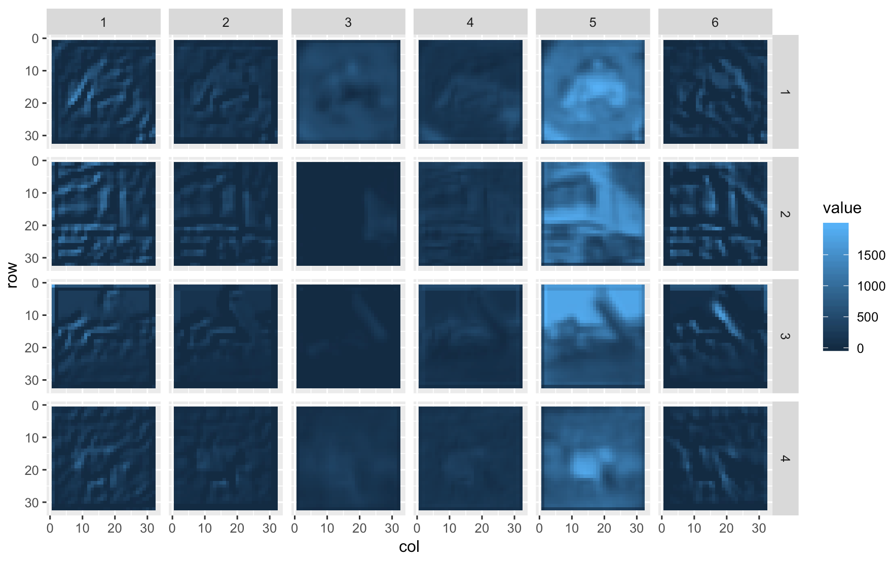

# TidyTensor - More Fun with Deep Learning

TidyTensor is an R package for inspecting and manipulating tensors (multidimensional arrays). It provides an improved `print()` function for summarizing structure, named tensors, conversion to data frames, and high-level manipulation functions. Designed to companion the excellent `keras` package, functionality is layered on top of base R types.

TidyTensor was inspired by a workshop I taught in deep learning with R, and a desire to explain and explore tensors in a more intuitive way.  

   * [Installation](#installation)
   * [Background](#background)
   * [Printing](#printing)
   * [Named Ranks](#named-ranks)
   * [Converting to data.frame and plotting](#converting-to-dataframe-and-plotting)
   * [Manipulation](#manipulation)

<br />
<br />
<br />

### Installation

A simple `devtools::install_github("oneilsh/tidytensor")` will do it. If you don't have `devtools`, grab it with `install.packages("devtools")`. 

### Background

R natively supports *tensors* as one of vectors (1d arrays, or rank-1 tensors), matrices (2d arrays, or rank-2 tensors), or higher-dimensional arrays. Further, these support `names()`, allowing for indexing of elements by index and/or name. 

```r
t1 <- c(1.4, 2.5, 0.5, 1.3)
t1[3]
# [1] 0.5

names(t1) <- c("a", "b", "c", "d")
t1["c"]
#   c 
# 0.5 
```

Matrices:

```r
t2 <- matrix(1:6, nrow = 2, ncol = 3)
t2
```

```
#      [,1] [,2] [,3]
# [1,]    1    3    5
# [2,]    2    4    6
```

```r
t2[1, 2]
```

```
# [1] 3
```

```r
dimnames(t2) <- list(c("row1", "row2"), c("col1", "col2", "col3"))
t2
```
```
#      col1 col2 col3
# row1    1    3    5
# row2    2    4    6
```
```r
t2["row1", "col2"]
```
```
# [1] 3
```

Higher-rank arrays can be created with e.g. `array(1:(3*6*6), dim = c(3, 6, 6))` to create a 3x6x6 structure--these also accept optional `dimnames()`. The *shape* of a tensor is the vector returned by `dim()`, here `c(3, 6, 6)`. To stay with convention we use 'rank' of a tensor rather than 'dimension' of a tensor to avoid confusion in situations like 3d-points being stored in a rank-1 tensor of shape (3). 

TidyTensor levereges the fact that tensors usually represent hierarchical "set of" relationships. For example, a 28x28 grayscale image may be encoded as a rank-2, shape (28, 28) tensor; an RBG color image of the same size would be represented with a rank-3 (3, 28, 28) tensor in a "channels first" representation. On the other hand, we might start with a pixel, represented as a rank-1 shape (3) tensor, and a color image as a 28x28 grid of them with shape (28, 28, 3) in a channels-last representation. (In a [row, col] assumption, this makes each *column* a set of pixels, and each *row* a set of columns.) A set of 1800 color images (1 minute video at 30fps) would be a rank-4 tensor with shape (1800, 3, 28, 28); a set of 100 videos would have shape (100, 1800, 3, 28, 28). 

If this were stored in the R array `data`, then `data[20, 57, , , ]` would select the color image from the 57th frame of the 20th video. By default it would return the shape (3, 28, 28) array from that location, dropping the ranks with only one entry. (This doc similarly refers to individual 'ranks' of a tensor, rather than the sometimes used 'axes', mirroring the rank/dimension distinction.) This can be avoided with an additional `drop = F` parameter: `data[20, 57, , , , drop = F]` returns the rank-5 tensor with shape (1, 1, 3, 28, 28).

### Printing

The default print function for arrays in R is... not great. Whereas groups are typically organized in tensors "leftward," R breaks them down "rightward" and provides little hierarchical organization. (I think Python's `numpy` arrays are better in this regard, but still leave a lot to be desired.) Consider a simulated dataset of 4 color 10x10 images (channels-first):

```r
array(rnorm(4*3*10*10), dim = c(4, 3, 10, 10))
```

``` 
# , , 1, 1
# 
#             [,1]       [,2]      [,3]
# [1,]  0.72733056 -0.2473793 0.7246183
# [2,] -0.02961571 -0.6277961 1.3537430
# [3,]  0.53652082 -0.8531169 1.8976249
# [4,]  0.49515707  0.4510950 0.1110309
# 
# , , 2, 1
# 
#            [,1]        [,2]       [,3]
# [1,]  1.8017886 -0.36434137 -0.5022344
# [2,]  0.8728468 -0.38282962  0.8931795
# [3,] -0.5263026 -0.55057900 -1.1352055
# [4,] -0.7984145  0.08755078 -0.5806810
# 
# , , 3, 1
# 
#             [,1]       [,2]       [,3]
# [1,] -0.26588696 -1.2376636 -0.9721222
# [2,]  0.04935331 -0.8383761  0.2938657
# # ...
```

TidyTensor provides a customized `print()` by allowing R vectors, matrices, and arrays to be converted with `as.tidytensor()`, or
the shorthand `tt()`. 

```r
library(tidytensor)
array(rnorm(4*3*10*10), dim = c(4, 3, 10, 10)) %>% 
  tt()
```
```
# Rank 4 tensor, shape: (4, 3, 10, 10)
|  # Rank 3 tensor, shape: (3, 10, 10)
|  |  # Rank 2 tensor, shape: (10, 10)
|  |      -0.839   -1.7  -0.354   -1.03   0.515   0.935  ... 
|  |        1.24   1.24   0.876   -1.09  0.0773    1.84  ... 
|  |       0.213  -1.45   -1.18   -1.14   0.488   -2.13  ... 
|  |      -0.744  0.113   -0.94  0.0892  -0.359    -1.4  ... 
|  |        1.33   1.72   -1.87   -1.56    1.15  -0.279  ... 
|  |       0.845  -1.05  -0.482   -1.36   0.458   0.451  ... 
|  |         ...    ...     ...     ...     ...     ...  ... 
|  |  # ...
|  # ...

```

Here the printout is emphasizing the nested nature of tensors and providing a quick structure summary. 

`as.tidytensor()` simply adds an addtional `tidytensor` class entry, so the array can still be used in all the normal ways. The `print()`
function can be customized to show more or fewers rows and columns in the "bottom" tensors and to show dimension names there (it's on the TODO list to also incorporate dimesion names for higher ranks). 

```r
images <- array(rnorm(4*3*10*10), dim = c(4, 3, 10, 10))
dimnames(images)[[3]] <- letters[1:10]
images %>%
  tt() %>%
  print(show_names = T, max_rows = 10, max_cols = 10)
```
```
# Rank 4 tensor, shape: (4, 3, 10, 10)
|  # Rank 3 tensor, shape: (3, 10, 10)
|  |  # Rank 2 tensor, shape: (10, 10)
|  |                [,1]    [,2]     [,3]    [,4]    [,5]      [,6]    [,7]    [,8]     [,9]   [,10] 
|  |      ["a",]   0.175  -0.308   -0.445   -2.72  -0.743  -0.00832   -1.44  -0.479    0.656  -0.508 
|  |      ["b",]   0.485  0.0974   -0.147   0.377   0.975      1.93    2.11   0.195    -0.51  -0.869 
|  |      ["c",]   0.517   0.903    0.667   0.023   -1.81     -2.33   -1.03     1.2    0.362   -1.05 
|  |      ["d",]   -0.66   0.707    0.383  -0.166    1.83     0.128   0.878  0.0589    0.261   0.365 
|  |      ["e",]    1.71   -2.25    0.822  -0.919  -0.626     -2.12   0.931   -2.76    0.149   0.338 
|  |      ["f",]    -1.6   0.587   0.0237  -0.539   0.858     0.894   -1.25     1.7  -0.0529   -1.35 
|  |      ["g",]   -1.85   -1.16  -0.0497    1.21    1.69     0.113    2.05  -0.199   -0.865  -0.775 
|  |      ["h",]  -0.374  0.0403    -1.32    1.59   -1.73    -0.249  -0.699   -1.43    0.624   -0.56 
|  |      ["i",]   -0.19   0.959     -0.5    0.23  -0.618     0.978    1.17  -0.563    -1.57    1.34 
|  |      ["j",]   -0.76    1.45    0.685   -1.42  -0.248   -0.0605    2.85  -0.243     0.64   -1.17 
|  |  # ...
|  # ...

```

And we can see more of the structure by increasing the `max_per_level` parameter:

```r
images %>%
  tt() %>%
  print(max_per_level = 2)
```
```
# Rank 4 tensor, shape: (4, 3, 10, 10)
|  # Rank 3 tensor, shape: (3, 10, 10)
|  |  # Rank 2 tensor, shape: (10, 10)
|  |      0.175  -0.308  -0.445   -2.72  -0.743  -0.00832  ... 
|  |      0.485  0.0974  -0.147   0.377   0.975      1.93  ... 
|  |      0.517   0.903   0.667   0.023   -1.81     -2.33  ... 
|  |      -0.66   0.707   0.383  -0.166    1.83     0.128  ... 
|  |       1.71   -2.25   0.822  -0.919  -0.626     -2.12  ... 
|  |       -1.6   0.587  0.0237  -0.539   0.858     0.894  ... 
|  |        ...     ...     ...     ...     ...       ...  ... 
|  |  # Rank 2 tensor, shape: (10, 10)
|  |      -0.0687  -0.0817  -0.691  -0.509    0.17    1.91  ... 
|  |         1.07   -0.761  0.0629  0.0457   0.156   0.123  ... 
|  |        -0.58     1.19    0.45    1.53   0.658   0.102  ... 
|  |         1.12    0.572   -1.69   -1.65  -0.994    0.48  ... 
|  |        0.621     2.71    1.87  -0.695    1.23  -0.167  ... 
|  |        0.744    -0.48  -0.936   -1.42  -0.369    1.13  ... 
|  |          ...      ...     ...     ...     ...     ...  ... 
|  |  # ...
|  # Rank 3 tensor, shape: (3, 10, 10)
|  |  # Rank 2 tensor, shape: (10, 10)
|  |         1.05   -0.486  -0.755     1.46   -0.62   0.391  ... 
|  |        0.773   -0.426   0.245   -0.209   0.696   0.367  ... 
|  |        0.248  -0.0409  -0.137       -1  -0.549   0.967  ... 
|  |       -0.295   -0.411   -1.21   -0.194   0.766  -0.419  ... 
|  |      -0.0895    0.445   0.272    -1.24    1.32   0.152  ... 
|  |       -0.527  -0.0465    1.03  -0.0081  -0.955   0.341  ... 
|  |          ...      ...     ...      ...     ...     ...  ... 
|  |  # Rank 2 tensor, shape: (10, 10)
|  |         1.62   0.567  -0.983  -0.566   -2.15   0.385  ... 
|  |       -0.105    1.85  -0.522   -1.34  -0.627    0.85  ... 
|  |       -0.673   -2.27    1.48   -1.66   0.159   -4.23  ... 
|  |        0.279   -1.95   0.829   0.884   0.986  -0.257  ... 
|  |      -0.0818   -1.01  -0.708   -1.48   -1.06   -1.41  ... 
|  |        -2.38  -0.508    1.71   0.667  -0.119    1.38  ... 
|  |          ...     ...     ...     ...     ...     ...  ... 
|  |  # ...
|  # ...
```

What if our data were in channels-last configuration? In cases where we want to visualize the last rank as a vector within a matrix like this
(pixels in an image, or channels in a filter map) we can specify `bottom = "3d"`.

```r
array(rnorm(4*10*10*3), dim = c(4, 10, 10, 3)) %>%
  tt() %>%
  print(bottom = "3d")
```
```
# Rank 4 tensor, shape: (4, 10, 10, 3)
|  # Rank 3 tensor, shape: (10, 10, 3)
|          [0.866, 0.183, 1.05]    [0.815, 0.0934, -1.72]  [0.573, 0.425, -1.89]      [-0.356, 0.438, 2.34]    [1.54, -0.159, -1.59]     [0.0329, 1.68, 2.2]  ... 
|         [1.91, -1.59, -0.444]     [0.0151, -1.2, 0.613]   [1.02, 0.882, 0.303]  [-0.764, -0.212, -0.0132]     [0.998, 1.71, 0.358]  [-0.0103, -1.24, -1.6]  ... 
|          [1.15, -1.25, 0.153]   [0.445, -0.185, -0.651]    [1.03, 0.551, 0.07]        [1.7, 0.165, 0.474]  [-0.353, -1.72, -0.193]    [-0.825, 0.29, 1.53]  ... 
|       [-0.566, -0.295, 0.773]     [0.0525, 1.54, 0.262]  [-0.737, -1.53, 1.42]    [0.987, -0.037, -0.589]   [-0.689, 0.95, -0.927]      [2.09, 1.17, 1.39]  ... 
|      [0.453, -0.0282, -0.763]      [-0.785, 0.32, 0.25]  [-0.212, 0.268, 1.28]        [1.15, -1.2, 0.584]   [-0.111, 0.186, 0.969]  [0.656, -0.468, -1.78]  ... 
|          [-1.6, 0.272, 0.455]  [-0.551, -2.03, -0.0733]    [0.601, 1.18, 1.34]     [-0.892, 0.809, 0.107]    [1.32, -0.669, -3.04]   [-0.518, 1.77, 0.748]  ... 
|                           ...                       ...                    ...                        ...                      ...                     ...  ... 
|  # ...
```

Here each channel is represented as a vector within the grid. There's also a `bottom = "1d"` for situations where a grid display doesn't make sense.

```r
array(rnorm(4*10*8), dim = c(4, 10, 8)) %>%
  tt() %>%
  print(bottom = "1d", max_per_level = 2)
```
```
# Rank 3 tensor, shape: (4, 10, 8)
|  # Rank 2 tensor, shape: (10, 8)
|  |  # Rank 1 tensor, shape: (8)
|  |      0.291  0.751  -0.0842  0.991  -0.626  -0.6  ... 
|  |  # Rank 1 tensor, shape: (8)
|  |      0.814  -0.478  1.15  -0.244  -1.62  -1.28  ... 
|  |  # ...
|  # Rank 2 tensor, shape: (10, 8)
|  |  # Rank 1 tensor, shape: (8)
|  |      -0.987  -0.451  2.17  0.838  0.646  -0.868  ... 
|  |  # Rank 1 tensor, shape: (8)
|  |      0.429  0.481  -0.339  -1.78  0.332  1.42  ... 
|  |  # ...
|  # ...
```

The default for `bottom` is `"auto"`, which selects `"2d"` when the input may be a set of channels-first images (3rd-to-last rank is of size 3, or last two ranks are equal in size), `"3d"` if it looks like a channels-last image (last rank is of size 3 or 1), and otherwise falls back to `"1d"`. 

### Named Ranks

Tidytensors support `ranknames()` in addition to `dimnames()` (implemented as `names(dimnames())`) for meaningful annotation. Here's a basic print for the CIFAR10 
dataset provided by `keras`:

```r
images <- dataset_cifar10()$train$x
images %>% tt()
```

```
# Rank 4 tensor, shape: (50000, 32, 32, 3)
|  # Rank 3 tensor, shape: (32, 32, 3)
|      [59, 62, 63]  [43, 46, 45]   [50, 48, 43]   [68, 54, 42]   [98, 73, 52]  [119, 91, 63]  ... 
|      [16, 20, 20]     [0, 0, 0]     [18, 8, 0]    [51, 27, 8]   [88, 51, 21]  [120, 82, 43]  ... 
|      [25, 24, 21]    [16, 7, 0]    [49, 27, 8]   [83, 50, 23]  [110, 72, 41]  [129, 92, 54]  ... 
|      [33, 25, 17]   [38, 20, 4]   [87, 54, 25]  [106, 63, 28]  [115, 70, 33]  [117, 74, 35]  ... 
|      [50, 32, 21]  [59, 32, 11]  [102, 65, 34]  [127, 79, 39]  [124, 77, 36]  [121, 77, 36]  ... 
|      [71, 48, 29]  [84, 53, 24]  [110, 73, 37]  [129, 82, 38]  [136, 88, 45]  [131, 84, 42]  ... 
|               ...           ...            ...            ...            ...            ...  ... 
|  # ...

```

A set of 50000 32x32 RGB images, in a channels-last organization. We can set ranknames with either `ranknames(t) <-` syntax or the `%>%`-friendly tidy-unquoted `set_ranknames()`.

```r
images <- dataset_cifar10()$train$x

images <- tt(images)
ranknames(images) <- c("image", "row", "col", "channel")
images

# OR
images %>%
  tt() %>%
  set_ranknames(image, row, col, channel)

# OR
images %>%
  tt() %>%
  set_ranknames(.dots = c("image", "row", "col", "channel"))
```

```
# Rank 4 tensor, shape: (50000, 32, 32, 3), ranknames: image, row, col, channel
|  # Rank 3 tensor, shape: (32, 32, 3)
|      [59, 62, 63]  [43, 46, 45]   [50, 48, 43]   [68, 54, 42]   [98, 73, 52]  [119, 91, 63]  ... 
|      [16, 20, 20]     [0, 0, 0]     [18, 8, 0]    [51, 27, 8]   [88, 51, 21]  [120, 82, 43]  ... 
|      [25, 24, 21]    [16, 7, 0]    [49, 27, 8]   [83, 50, 23]  [110, 72, 41]  [129, 92, 54]  ... 
|      [33, 25, 17]   [38, 20, 4]   [87, 54, 25]  [106, 63, 28]  [115, 70, 33]  [117, 74, 35]  ... 
|      [50, 32, 21]  [59, 32, 11]  [102, 65, 34]  [127, 79, 39]  [124, 77, 36]  [121, 77, 36]  ... 
|      [71, 48, 29]  [84, 53, 24]  [110, 73, 37]  [129, 82, 38]  [136, 88, 45]  [131, 84, 42]  ... 
|               ...           ...            ...            ...            ...            ...  ... 
|  # ...
```

(Another TODO: show ranknames for bottom ranks at those levels as well.) 

Named ranks make a variety of operations easier, or at least more explicit. For example, we may wish to permute the ranks to a channels-first representation, then 
set dimensions names for the `channel` rank.

```r
images %>%
  tt() %>%
  set_ranknames(image, row, col, channel) %>%
  permute(image, channel, row, col) %>%
  set_dimnames_for_rank(channel, R, G, B) %>%
  print(max_per_level = 2)
```

```
# Rank 4 tensor, shape: (50000, 3, 32, 32), ranknames: image, channel, row, col
|  # Rank 3 tensor, shape: (3, 32, 32)
|  |  # Rank 2 tensor, shape: (32, 32)
|  |       59   43   50   68   98  119  ... 
|  |       16    0   18   51   88  120  ... 
|  |       25   16   49   83  110  129  ... 
|  |       33   38   87  106  115  117  ... 
|  |       50   59  102  127  124  121  ... 
|  |       71   84  110  129  136  131  ... 
|  |      ...  ...  ...  ...  ...  ...  ... 
|  |  # Rank 2 tensor, shape: (32, 32)
|  |       62   46   48   54   73   91  ... 
|  |       20    0    8   27   51   82  ... 
|  |       24    7   27   50   72   92  ... 
|  |       25   20   54   63   70   74  ... 
|  |       32   32   65   79   77   77  ... 
|  |       48   53   73   82   88   84  ... 
|  |      ...  ...  ...  ...  ...  ...  ... 
|  |  # ...
|  # Rank 3 tensor, shape: (3, 32, 32)
|  |  # Rank 2 tensor, shape: (32, 32)
|  |      154  126  105  102  125  155  ... 
|  |      140  145  125  124  150  152  ... 
|  |      140  139  115  147  138  132  ... 
|  |      136  137  122  132  151  181  ... 
|  |      129  141  136  186  215  202  ... 
|  |      136  136  127  153  138  120  ... 
|  |      ...  ...  ...  ...  ...  ...  ... 
|  |  # Rank 2 tensor, shape: (32, 32)
|  |      177  137  104  101  131  166  ... 
|  |      160  153  125  129  161  164  ... 
|  |      155  146  115  153  150  145  ... 
|  |      147  142  121  133  157  193  ... 
|  |      137  146  139  186  220  216  ... 
|  |      144  149  148  172  160  141  ... 
|  |      ...  ...  ...  ...  ...  ...  ... 
|  |  # ...
|  # ...
```

### Converting to `data.frame` and plotting

Named ranks also work well with conversion to data frame. We'll convert just a few images, because tensors in data frame representation are significantly larger (approximately number-of-ranks times as large). `as.data.frame()` will by default throw an error when more than a million-entry
data frame would result, unless `allow_huge = TRUE` is set.

```r
images[1:4, , , ] %>%
  tt() %>%
  set_ranknames(image, row, col, channel) %>%
  permute(image, channel, row, col) %>%
  set_dimnames_for_rank(channel, R, G, B) %>%
  as.data.frame() %>%
  head()
```
```
  image channel row col value
1     1       R   1   1    59
2     2       R   1   1   154
3     3       R   1   1   255
4     4       R   1   1    28
5     1       G   1   1    62
6     2       G   1   1   177
```

The third row here indicates that the value in `images[3, "R", 1, 1]` is 255. Non-named tensors get generic 
column names. In the case of set `dimnames()` as in `R`, `G`, and `B` above, factors are created
with the level ordering determined by the `dimnames()` ordering. 

This provides a nice interface for visualization with `ggplot2`.

```r
images[1:4, , , ] %>%
  tt() %>%
  set_ranknames(image, row, col, channel) %>%
  permute(image, channel, row, col) %>%
  set_dimnames_for_rank(channel, R, G, B) %>%
  as.data.frame() %>%
  ggplot() +
    geom_tile(aes(x = col, y = row, fill = value)) +
    facet_grid(channel ~ image) +
    coord_equal()
```


It's a little hard to make out, but these images are upside-down, because image data are typically encoded with the origin in the upper-left rather than the lower-right, and inverted, so next time we'll add a `scale_y_reverse()` as well. To get fancy, we can use `tidyr::spread()` to create individual `R`, `G`, and
`B` columns, combined with `rgb()` and `scale_fill_identity()` to merge the channels into color images.

```r
library(tidyr)

images[1:4, , , ] %>%
  tt() %>%
  set_ranknames(image, row, col, channel) %>%
  permute(image, channel, row, col) %>%
  set_dimnames_for_rank(channel, R, G, B) %>%
  as.data.frame() %>%
  spread(channel, value) %>%
  ggplot() +
    geom_tile(aes(x = col, y = row, fill = rgb(R, G, B, maxColorValue = 255))) +
    facet_wrap( ~ image) +
    coord_equal() +
    scale_y_reverse() +
    scale_fill_identity()
```


These techniques work nicely for model investigation, for example in plotting feature maps produced interally in deep models. We'll start by importing a predefined model and creating a function that maps input tensors to feature maps using the `keras` API.

```r
vgg_model <- application_vgg16(include_top = FALSE, input_shape = c(32, 32, 3))

input <- vgg_model$input
output <- get_layer(vgg_model, name = "block1_conv2")$output

compute_featuremaps <- k_function(input, output)
```

To visualize the feature maps we generate an output tensor, name it, convert it to data frame, select only the first six featuremaps with `dplyr::filter()` to keep it reasonable, and then plot the values.

```r
library(dplyr)

compute_featuremaps(images[1:4, , ,]) %>% # produces shape (4, 32, 32, 64) tensor, where last rank are feature maps
  tt() %>%
  set_ranknames(image, row, col, featuremap) %>%
  as.data.frame(allow_huge = T) %>%
  filter(featuremap <= 6) %>%
  ggplot() +
    geom_tile(aes(x = col, y = row, fill = value)) +
    facet_grid(image ~ featuremap) +
    coord_equal() +
    scale_y_reverse()
```




### Manipulation
